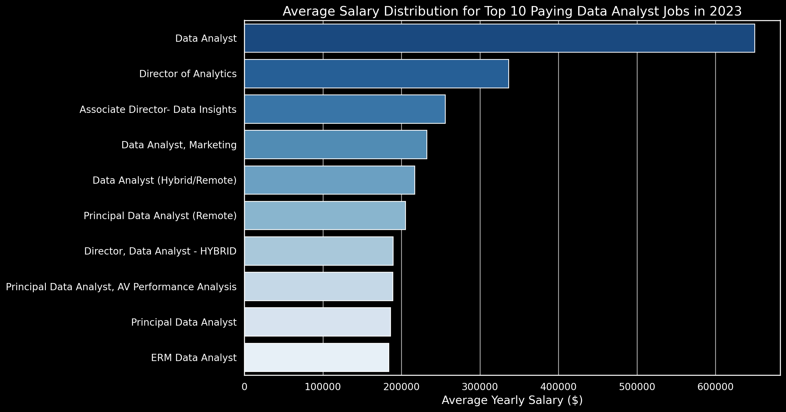

# SQL Data Jobs Market Analysis

📊 An exploration of the data analyst job market using SQL — focusing on 💰 top-paying roles, 🔥 in-demand skills, and 📈 where high demand meets high salary.

🔍 SQL queries used in this project: [queries folder](/queries/)

---

## Introduction

As someone actively pursuing data analyst roles, I wanted to go beyond guesswork and answer the questions that actually matter when planning a career in data: which skills should I focus on, what can I realistically expect to earn, and where does demand align with higher pay?

This project uses SQL to analyse a real-world dataset of data analyst job postings, turning those questions into concrete, data-backed answers.

### Questions I Set Out to Answer

1. What are the top-paying data analyst jobs?
2. What skills are required for these top-paying jobs?
3. What skills are most in demand for data analysts?
4. Which skills are associated with higher salaries?
5. What are the most optimal skills to learn?

---

## Tools Used

- **SQL** — the core of the entire analysis, used to query the database and extract meaningful insights
- **PostgreSQL** — the database management system used to store and query the job postings data
- **Visual Studio Code** — for writing and executing SQL queries
- **Git & GitHub** — for version control and sharing the project

---

## The Analysis

Each query targeted a specific aspect of the data analyst job market. Here's how I approached each question:

### 1. Top Paying Data Analyst Jobs

To identify the highest-paying roles, I filtered data analyst positions by average yearly salary, focusing on remote jobs where salary data was available.

```sql
SELECT	
	job_id,
	job_title,
	job_location,
	job_schedule_type,
	salary_year_avg,
	job_posted_date,
    name AS company_name
FROM
    job_postings_fact
LEFT JOIN company_dim ON job_postings_fact.company_id = company_dim.company_id
WHERE
    job_title_short = 'Data Analyst' AND 
    job_location = 'Anywhere' AND 
    salary_year_avg IS NOT NULL
ORDER BY
    salary_year_avg DESC
LIMIT 10;
```

**Key findings:**
- The salary range for the top 10 remote data analyst roles spans from $184,000 to $650,000 — a remarkably wide range that reflects how varied the role can be at senior levels
- Companies like SmartAsset, Meta, and AT&T feature among the top payers, showing demand for data talent across very different industries
- Job titles vary significantly — from Data Analyst to Director of Analytics — reflecting the range of specialisations within data


*Bar chart of the top 10 salaries for remote data analyst roles, based on SQL query results*

---

### 2. Skills for Top Paying Jobs

To understand what skills underpin the highest-paying roles, I joined the job postings data with skills data to see what employers are actually requiring for top-compensation positions.

```sql
WITH top_paying_jobs AS (
    SELECT	
        job_id,
        job_title,
        salary_year_avg,
        name AS company_name
    FROM
        job_postings_fact
    LEFT JOIN company_dim ON job_postings_fact.company_id = company_dim.company_id
    WHERE
        job_title_short = 'Data Analyst' AND 
        job_location = 'Anywhere' AND 
        salary_year_avg IS NOT NULL
    ORDER BY
        salary_year_avg DESC
    LIMIT 10
)

SELECT 
    top_paying_jobs.*,
    skills
FROM top_paying_jobs
INNER JOIN skills_job_dim ON top_paying_jobs.job_id = skills_job_dim.job_id
INNER JOIN skills_dim ON skills_job_dim.skill_id = skills_dim.skill_id
ORDER BY
    salary_year_avg DESC;
```

**Key findings:**
- **SQL** appears in 8 out of the top 10 highest-paying roles — confirming it as the single most critical skill for top-tier compensation
- **Python** follows closely, appearing in 7 of the top 10
- **Tableau** features in 6, reinforcing the importance of visualisation alongside technical skills
- R, Snowflake, Pandas, and Excel also appear, showing that breadth of skills matters at the top end


*Bar chart of skill frequency across the top 10 paying data analyst roles, based on SQL query results*

---

### 3. In-Demand Skills for Data Analysts

This query identifies which skills appear most frequently across all data analyst job postings — cutting through salary to focus purely on what employers are asking for.

```sql
SELECT 
    skills,
    COUNT(skills_job_dim.job_id) AS demand_count
FROM job_postings_fact
INNER JOIN skills_job_dim ON job_postings_fact.job_id = skills_job_dim.job_id
INNER JOIN skills_dim ON skills_job_dim.skill_id = skills_dim.skill_id
WHERE
    job_title_short = 'Data Analyst' 
    AND job_work_from_home = True 
GROUP BY
    skills
ORDER BY
    demand_count DESC
LIMIT 5;
```

**Key findings:**

| Skills   | Demand Count |
|----------|--------------|
| SQL      | 7291         |
| Excel    | 4611         |
| Python   | 4330         |
| Tableau  | 3745         |
| Power BI | 2609         |

*Demand count for the top 5 skills across remote data analyst job postings*

- **SQL and Excel** dominate as foundational skills — essential for any data analyst regardless of industry
- **Python, Tableau, and Power BI** round out the top 5, highlighting the growing importance of programming and visualisation skills
- This table directly informed my own learning priorities — SQL first, then Python and BI tools

---

### 4. Skills Associated with Higher Salaries

This query explores which specific skills correlate with higher average salaries — helping identify where to invest learning time for maximum financial return.

```sql
SELECT 
    skills,
    ROUND(AVG(salary_year_avg), 0) AS avg_salary
FROM job_postings_fact
INNER JOIN skills_job_dim ON job_postings_fact.job_id = skills_job_dim.job_id
INNER JOIN skills_dim ON skills_job_dim.skill_id = skills_dim.skill_id
WHERE
    job_title_short = 'Data Analyst'
    AND salary_year_avg IS NOT NULL
    AND job_work_from_home = True 
GROUP BY
    skills
ORDER BY
    avg_salary DESC
LIMIT 25;
```

**Key findings:**

| Skills        | Average Salary ($) |
|---------------|-------------------:|
| pyspark       |            208,172 |
| bitbucket     |            189,155 |
| couchbase     |            160,515 |
| watson        |            160,515 |
| datarobot     |            155,486 |
| gitlab        |            154,500 |
| swift         |            153,750 |
| jupyter       |            152,777 |
| pandas        |            151,821 |
| elasticsearch |            145,000 |

*Top 10 skills by average salary for remote data analyst roles*

- **Big data and machine learning tools** (PySpark, DataRobot, Jupyter) command the highest salaries, reflecting the premium placed on advanced data processing skills
- **DevOps and deployment tools** (GitLab, Bitbucket) appearing here suggests that analysts who can bridge data and engineering are particularly well compensated
- **Cloud skills** (Elasticsearch, Databricks) consistently appear at the higher salary end — a clear signal that cloud proficiency is increasingly valuable

---

### 5. Most Optimal Skills to Learn

The final query combines demand and salary data to identify skills that offer the best of both worlds — high demand and high pay. This is the most strategically useful analysis for anyone planning their skill development.

```sql
SELECT 
    skills_dim.skill_id,
    skills_dim.skills,
    COUNT(skills_job_dim.job_id) AS demand_count,
    ROUND(AVG(job_postings_fact.salary_year_avg), 0) AS avg_salary
FROM job_postings_fact
INNER JOIN skills_job_dim ON job_postings_fact.job_id = skills_job_dim.job_id
INNER JOIN skills_dim ON skills_job_dim.skill_id = skills_dim.skill_id
WHERE
    job_title_short = 'Data Analyst'
    AND salary_year_avg IS NOT NULL
    AND job_work_from_home = True 
GROUP BY
    skills_dim.skill_id
HAVING
    COUNT(skills_job_dim.job_id) > 10
ORDER BY
    avg_salary DESC,
    demand_count DESC
LIMIT 25;
```

**Key findings:**

| Skills     | Demand Count | Average Salary ($) |
|------------|--------------|-------------------:|
| go         | 27           |            115,320 |
| confluence | 11           |            114,210 |
| hadoop     | 22           |            113,193 |
| snowflake  | 37           |            112,948 |
| azure      | 34           |            111,225 |
| bigquery   | 13           |            109,654 |
| aws        | 32           |            108,317 |
| java       | 17           |            106,906 |
| ssis       | 12           |            106,683 |
| jira       | 20           |            104,918 |

*Top 10 most optimal skills for data analysts ranked by average salary*

- **Cloud platforms** — Snowflake, Azure, AWS, and BigQuery — feature prominently, combining strong demand with above-average salaries
- **Python and R** lead on demand volume (236 and 148 respectively) with solid average salaries around $100,000-$101,000, making them the most reliable all-round investments
- **BI tools** like Tableau and Looker show high demand and competitive salaries, reinforcing their value in the current market

---

## What I Learned

This project significantly deepened my practical SQL skills:

- **Complex query crafting** — built multi-step queries using CTEs (WITH clauses) to break down complex analysis into readable, manageable steps
- **Data aggregation** — applied GROUP BY, COUNT(), AVG(), and ROUND() to summarise large datasets into meaningful insights
- **Multi-table joins** — combined data across multiple related tables using INNER JOIN and LEFT JOIN to answer questions that no single table could answer alone
- **Analytical thinking** — practised translating real-world career questions into precise SQL queries and interpreting the results critically

---

## Conclusions

The analysis consistently points in the same direction for anyone building a data analyst career:

1. **SQL is non-negotiable** — it leads both demand and salary rankings, making it the single highest-priority skill to master
2. **Python is the essential complement** — high demand and solid salaries across all query results confirm its importance alongside SQL
3. **Cloud skills command a premium** — Azure, AWS, Snowflake, and BigQuery consistently appear at the higher salary end
4. **Specialised skills pay more but are riskier** — niche tools like PySpark and DataRobot offer the highest salaries but lower demand, making them better as additions to a strong foundation rather than starting points
5. **BI tools are widely expected** — Tableau and Power BI appear consistently across demand rankings, confirming their value as core portfolio tools

For someone early in their data career, the clearest path to market value is: SQL and Excel as the foundation, Python and a BI tool (Tableau or Power BI) as the next layer, and cloud skills as a longer-term investment.

---

*Built by [Soroush Ariana](https://github.com/Soroush-Ariana) — Data Analyst based in Nottingham, UK*
*📧 arianasoroush@gmail.com*
